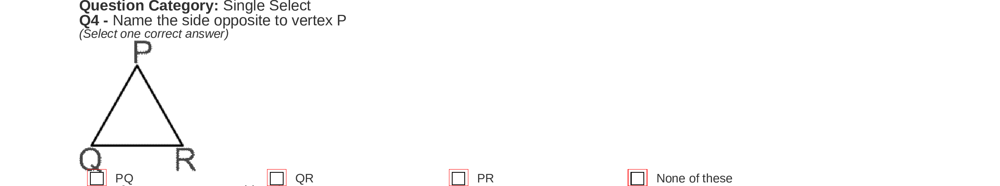

# Unet
This is a simple Unet code for semantic segmentation: [U-Net: Convolutional Networks for Biomedical Image Segmentation](https://arxiv.org/abs/1505.04597). In this code, the task example for Unet is option box segmentation in exam sheets. It is persumed that we have only two classes, target and the background(red boxes show the option boxes):




In order to keep it simple, the network does not include batch normalisation or dropouts.  Dice coefficient is used as a loss function.


### Dependencies
- python 3.6
- [TensorFlow >=2.0.0](https://www.tensorflow.org/get_started/os_setup)
- required packages:
    - `Pillow`
    - `numpy`
    - `skimage`

### Data Preprocessing and training
Preprocessing includes resizing each image to 512 x 1024 (If you would like to have different size change this parameter in the begining of train.py). The dataset images should be in the same folder with tif format. The mask images must be 1 channel images. The data should be located in as below:
```
-Data
 |
 ---- train_image
 |    |
 |    ---- qus_1.png
 |    |
 |    ---- …
 |
 ---- train_mask
 |    |
 |    ---- qus_1.png
 |    |
 |    ---- …
 |---- test_image
 |    |
 |    ---- qus_1.png
 |    |
 |    ---- …
 |---- test_mask
 |    |
 |    ---- qus_1.png
 |    |
      ---- …
```

When you start training, it first converts each folder in dataset (train_image, train_mask, test_image, test_mask) to numpy arrays using`Utils/prepare_data.py`. You need to run train.py as:

  ```
  python3 Main.py 
  ```


### Evaluation
- when training is finished, test images are also evaluated and written to the current directory as `results.npy`.
- `visualize_segmentation` in Main.py shows the result on the test images.

   

### Citing Unet
Ronneberger, O., Fischer, P., Brox, T.: U-net: Convolutional networks for biomedical
image segmentation. In: International Conference on Medical Image Computing
and Computer-Assisted Intervention. pp. 234–241. Springer (2015) [pdf](https://arxiv.org/abs/1505.04597).

    @inproceedings{fusenet2016accv,
     author    = "Olaf Ronneberger, Philipp Fischer, and Thomas Brox",
     title     = "U-Net: Convolutional Networks for Biomedical Image Segmentation",
     booktitle = "Medical Image Computing and Computer-Assisted Intervention – MICCAI 2015",
     year      = "2015",
     month     = "October",
    }
